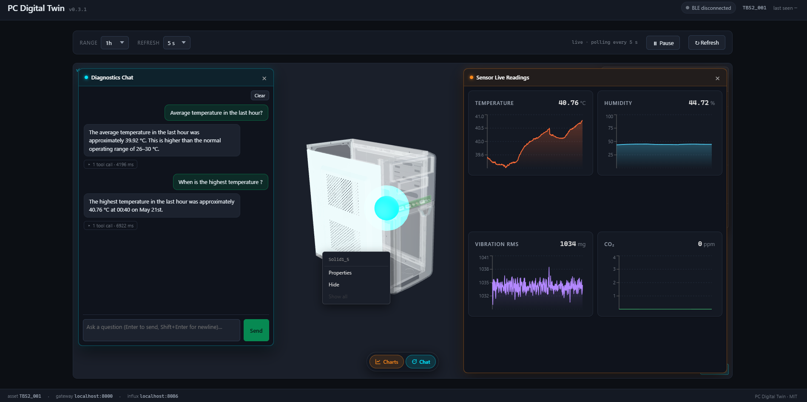

# PC Digital Twin

> A digital twin of a PC case: a Silicon Labs Thunderboard sensor node streams
> environmental data over BLE to a Python gateway, which persists to InfluxDB
> and serves an interactive React + Three.js dashboard. An LLM diagnostic
> agent analyzes recent telemetry on demand.



## What it does

A Thunderboard Sense board sits inside the case. Every two seconds the
gateway reads temperature, humidity, pressure, ambient light, and 3-axis
acceleration over Bluetooth Low Energy, writes them to a time-series
database, and exposes a REST API. A web dashboard renders the data as live
charts alongside a 3D model of the case. A conversational diagnostics
agent (Ollama + `llama3.1:8b`) answers natural-language questions about
the telemetry by calling Influx-backed tools and narrating the result —
the chat panel lives inside the 3D viewer as a popup.

The screenshot above is real telemetry from a Thunderboard sitting on the
desk — note the steady self-heating curve, the anti-correlated humidity, and
the **vibration spike at 19:05:33** captured when the board was bumped.

## What this demonstrates

- **IoT / BLE stack** — discovering, connecting, subscribing to GATT
  characteristics (both standard SIG Environmental Sensing and Silicon Labs
  custom services) with `bleak`, including graceful reconnect on Windows
  BLE quirks.
- **Async Python service design** — FastAPI with a background BLE task in
  the app lifespan, pydantic v2 schemas, layered modules
  (`ble`, `influx`, `api`, `llm`, `models`).
- **Time-series ingestion** — InfluxDB 2.x with Flux queries for history
  endpoints; bucketed measurements `case_sensor_data`, `case_boot_event`,
  `case_gateway_status`.
- **3D web visualization** — Three.js via `@react-three/fiber` and `drei`,
  with a sensor-state → mesh-color overlay system.
- **LLM-backed diagnostics** — a planner→tool→narrator chat agent on
  `POST /api/chat`. The planner (Ollama-hosted `llama3.1:8b`) decides
  which Influx tool to call (`query_window`, `find_anomalies`,
  `compare_windows`); the narrator pass synthesises a short English
  answer from the result. Includes a salvage layer for small models
  that occasionally emit tool calls as inline JSON, plus tz-aware
  timestamps so the chat and the charts agree. See
  [`docs/STAGE3.md`](docs/STAGE3.md).
- **Forecasting tools (Stage 4, in progress)** — three additional LLM
  tools built on a pure least-squares trend fit restricted to the
  **current active session** (samples not separated by a powered-off
  gap). `forecast_window` projects a metric forward over 15m / 1h / 6h;
  `time_to_threshold` answers *"when will X cross Y?"*;
  `forecast_accuracy` backtests the same forecaster over recent history
  and reports measured **MAE / RMSE** in the metric's native units so
  the agent can quote forecast error honestly instead of inventing
  confidence. All three refuse rather than fabricate when the data is
  too short or the trend points the wrong way. UI overlay is still to
  come — see [Status](#status) and [`docs/STAGE3.md`](docs/STAGE3.md)
  for Stage 4 direction.
- **Hardware adaptation** — the spec assumed a Thunderboard Sense 2 with
  custom firmware emitting JSON-over-notify; the actual hardware was a
  Sense v1 (BRD4160A) running stock SiLabs demo firmware. The gateway was
  rewritten to talk to the stock GATT services without firmware reflash —
  see [`docs/results/v0.1.0-ble-probe.txt`](docs/results/v0.1.0-ble-probe.txt)
  and the change log in [`CHECKPOINT.md`](CHECKPOINT.md).
- **Infra as code** — InfluxDB via `docker compose`, reproducible
  `.env.example`, `requirements.txt`, `package.json` with lockfile.

## Architecture

```
 ┌─────────────────────┐       BLE (GATT)        ┌──────────────────────────┐
 │  Thunderboard Sense │ ─────────────────────►  │  Gateway (FastAPI)       │
 │  (Si7021, BMP280,   │                         │  ble/   scanner+parser   │
 │   ICM-20648, Si1133)│                         │  influx writer           │
 └─────────────────────┘                         │  api/   /sensor /status  │
                                                 │         /events /chat    │
                                                 │  llm/   planner+tools+   │
                                                 │         narrator (Ollama)│
                                                 └────────────┬─────────────┘
                                                              │ writes / reads
                                                              ▼
                                                   ┌────────────────────┐
                                                   │  InfluxDB 2.x      │
                                                   │  case_sensor_data  │
                                                   └─────────┬──────────┘
                                                             │ Flux query
                                                             ▼
                                                   ┌────────────────────┐
                                                   │  Frontend (Vite +  │
                                                   │  React + Three.js) │
                                                   │  charts + 3D twin  │
                                                   │  + chat popup      │
                                                   └────────────────────┘
```

## Stack

| Layer | Technologies |
|---|---|
| Hardware | Silicon Labs Thunderboard (BRD4160A); BLE 4.2 GATT |
| Gateway | Python 3.11, FastAPI, Uvicorn, `bleak`, `influxdb-client`, pydantic-settings, httpx |
| Storage | InfluxDB 2.7 (Docker) |
| Frontend | React 18, TypeScript, Vite, `three`, `@react-three/fiber`, `@react-three/drei`, `recharts`, axios |
| LLM | Ollama (default `llama3.1:8b`) via OpenAI-compatible `/v1`; legacy one-shot endpoint also supports Anthropic Claude |
| Firmware | C, Silicon Labs Simplicity Studio (stubbed — using stock demo firmware) |

## Status

| Stage | Goal | Status |
|---|---|---|
| 1 — Data Collection | BLE → Gateway → InfluxDB | ✅ Done |
| 2 — Visualization | Charts + 3D model | ✅ Done (named-mesh color overlay pending Blender re-export) |
| 3 — Diagnostics | LLM chat agent + tools | ✅ Done at `v0.3.2` — see [`docs/STAGE3.md`](docs/STAGE3.md) |
| 4 — Predictive layer | Intra-session forecasting + measured accuracy | 🟡 In progress — Phases 0/1/2/5 done, 3/4 pending |

**Stage 4 — what's shipped**: Phase 0 (`gateway/verify_data.py` readiness
tool — locks scope to intra-session per the live-data verdict), Phase 1
(`forecast_window` LLM tool, pure linear-trend engine in
`gateway/llm/forecast.py`), Phase 2 (`time_to_threshold` LLM tool),
Phase 5 (backtest harness in `gateway/llm/backtest.py` + the
`forecast_accuracy` LLM tool that surfaces measured MAE/RMSE on
demand). The forecaster is now self-grading: the agent can answer
*"how trustworthy is the forecast?"* with measured numbers rather than
fabricated confidence. The dashboard does not yet overlay forecasts
(Phase 4), and baseline / drift tracking has not started (Phase 3).
The project is **not** described as a *predictive twin* in this README
until a live MAE/RMSE number from real data is quoted here.

See [`CHECKPOINT.md`](CHECKPOINT.md) for the iterative development journal,
[`docs/STAGE3.md`](docs/STAGE3.md) for the chat agent design + Stage 4
direction, and [`docs/SPEC.md`](docs/SPEC.md) for the original project
specification.

## Repo layout

```
firmware/   Custom firmware scaffold (C, Simplicity Studio — not yet flashed)
gateway/    Python FastAPI service: BLE → Influx + REST API
frontend/   React + Vite + Three.js dashboard
infra/      docker-compose for InfluxDB
docs/       Project spec, BLE protocol, sensor placement, results
```

## Quick start

Prereqs: Docker Desktop, Python 3.11+, Node 18+, a BLE-capable PC, a
Silicon Labs Thunderboard within ~5 m, and an Ollama instance reachable
on your network with `llama3.1:8b` pulled (for the chat agent).

```powershell
# 1. InfluxDB
cd infra
docker compose up -d
# UI at http://localhost:8086 — log in (admin / adminpassword),
# copy the admin API token.

# 2. Ollama (on the model host — can be the same machine or remote)
ollama pull llama3.1:8b
ollama serve

# 3. Gateway
cd ..\gateway
python -m venv venv
.\venv\Scripts\Activate.ps1
pip install -r requirements.txt
copy .env.example .env
# Edit .env:
#   - INFLUXDB_TOKEN     paste your admin token
#   - BLE_DEVICE_ADDRESS optional, faster than name discovery
#   - OLLAMA_BASE_URL    e.g. http://localhost:11434/v1
#   - OLLAMA_MODEL       e.g. llama3.1:8b
#   - LOCAL_TZ           IANA tz, e.g. Asia/Ho_Chi_Minh
python main.py
# API at http://localhost:8000/docs

# 4. Frontend
cd ..\frontend
npm install
npm run dev
# Open http://localhost:5173 — chat lives in the bottom toolbar of the
# 3D viewer.
```

`gateway/ble_scan.py` lists nearby BLE devices.
`gateway/ble_probe.py <MAC>` dumps the GATT tree of a target device — useful
when adapting to different firmware.

### Talking to the diagnostics agent

CLI smoke test:

```bash
curl -X POST http://localhost:8000/api/chat \
  -H "Content-Type: application/json" \
  -d '{"message":"When was the case temperature highest tonight?"}'
```

Expected: a short English answer plus `tool_calls` showing which Influx
tool was invoked. Full design notes in
[`docs/STAGE3.md`](docs/STAGE3.md).

## License

MIT — see [LICENSE](LICENSE).
